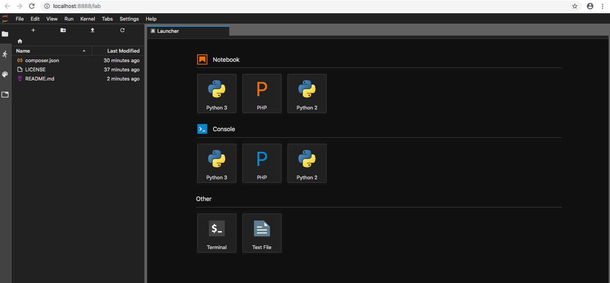

# php-jupyternotebook-es
Jupyter Notebook en PHP  y en español.

## Requisitos

Sigua las intrucciones para descargar e instalar [Jupiter-PHP-Instaler](https://litipk.github.io/Jupyter-PHP-Installer/) de acuerdo con su sistema operativo. A ser posible instale el archivo **.phar** globalmente para facilitarle la creación de más proyectos.

En la carpeta de este proyecto ejecute:

```
php jupyter-php-intaler.phar install
// o bien, si está instalado globalmente p.ej. en /usr/local/bin,
// en linux o macos, con el nombre jphpi (u otro similar)
jphpi install
```

Espere un momento hasta que aparezca el siguiente mensaje en su terminal:

```
The Jupyter-PHP kernel has been successfully installed.
```

## Iniciar Jupiter

Inicie Jupiter con el comando:

```
jupiter-lab
```

Si todo está conforme debería abrirse su navegador por defecto con la siguiente pantalla:



